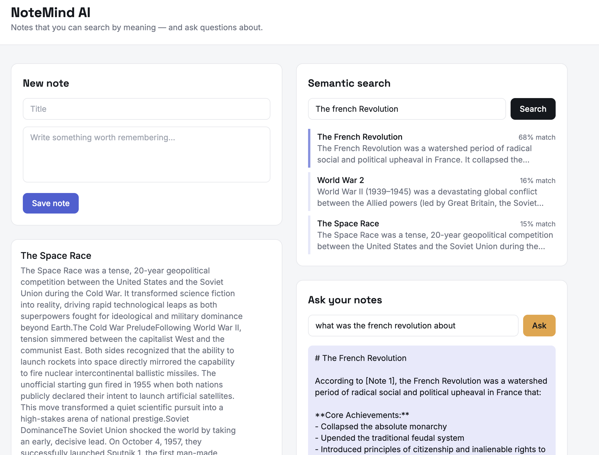

# NoteMind AI 🧠

A full-stack AI-powered notes app with semantic search and a RAG-based chat feature — ask questions and get answers from your own notes.

## Live Demo
- 🌐 Frontend: [coming soon]
- ⚙️ API Health: [coming soon]

## Screenshot



## What it does

- 📝 **Save notes** — create notes that are automatically embedded using OpenAI
- 🔍 **Semantic search** — search by meaning, not just keywords (powered by pgvector)
- 🤖 **Ask your notes** — chat with your knowledge base using Claude AI (RAG pipeline)

## Tech Stack

| Layer | Tech |
|---|---|
| Frontend | React + TypeScript + Vite + Tailwind CSS |
| Backend | Node.js + Express + TypeScript |
| Database | PostgreSQL + pgvector (Neon) |
| AI | OpenAI embeddings + Anthropic Claude |
| DevOps | Docker + GitHub Actions CI |
| Hosting | Vercel (frontend) + Render (backend) |

## How the AI works

1. When you save a note, the backend calls OpenAI's text-embedding-3-small model to convert the text into a 1536-dimension vector and stores it in Postgres using the pgvector extension
2. When you search, your query is embedded the same way and pgvector finds the closest notes by cosine similarity
3. When you ask a question, the most relevant notes are retrieved and passed to Claude as context — this is a Retrieval-Augmented Generation (RAG) pipeline

## Project Structure

notemind-ai/

├── client/

│   └── src/

│       ├── components/

│       │   ├── NoteEditor.tsx

│       │   ├── NoteList.tsx

│       │   ├── SearchBar.tsx

│       │   └── ChatBox.tsx

│       ├── api.ts

│       └── App.tsx

├── server/

│   └── src/

│       ├── routes/

│       │   └── notes.ts

│       ├── services/

│       │   ├── embeddings.ts

│       │   └── chat.ts

│       ├── db.ts

│       └── index.ts

├── docker-compose.yml

└── .github/workflows/

└── ci.yml

## API Endpoints

| Method | Endpoint | Description |
|---|---|---|
| GET | /health | Health check |
| GET | /api/notes | List all notes |
| POST | /api/notes | Create note (auto-embeds via OpenAI) |
| PUT | /api/notes/:id | Update note (re-embeds) |
| DELETE | /api/notes/:id | Delete note |
| GET | /api/notes/search?q= | Semantic vector search |
| POST | /api/notes/chat | Ask a question (RAG via Claude) |

## Running locally

### Prerequisites
- Node.js 18+
- A Neon database with vector extension enabled
- OpenAI API key
- Anthropic API key

### 1. Clone the repo

```bash
git clone https://github.com/DineshReddy0504/Notemind-ai.git
cd Notemind-ai
```

### 2. Backend setup

```bash
cd server
cp .env.example .env
npm install
npx prisma db push
npm run dev
```

### 3. Frontend setup

```bash
cd client
cp .env.example .env.local
npm install
npm run dev
```

## Environment Variables

### server/.env

DATABASE_URL=your_neon_connection_string

OPENAI_API_KEY=your_openai_key

ANTHROPIC_API_KEY=your_anthropic_key

PORT=4000

### client/.env.local

VITE_API_URL=http://localhost:4000

## CI/CD Pipeline

- GitHub Actions runs a TypeScript build check on every push to main
- Render auto-deploys the backend on every push to main
- Vercel auto-deploys the frontend on every push to main

## What I learned building this

- How vector embeddings work and why semantic search beats keyword search
- How to use pgvector in Postgres to store and query high-dimensional vectors
- How RAG works — retrieving context before generating an answer keeps the AI grounded in your actual data
- How to structure a TypeScript monorepo with a shared API contract between frontend and backend
- How to wire up a full CI/CD pipeline from GitHub to cloud hosting with zero manual steps

## Author

**Dinesh Reddy** — [github.com/DineshReddy0504](https://github.com/DineshReddy0504)
